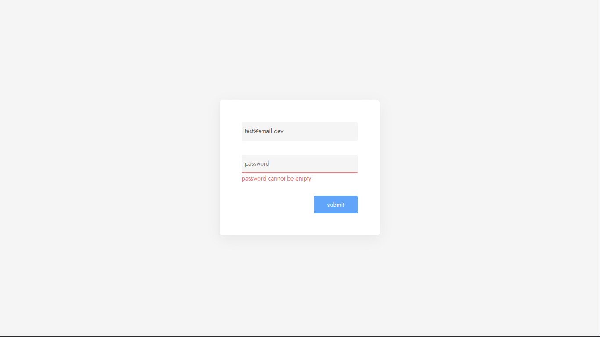

# Form Field Validation



**| React JS**

**| Typescript**

**| Styled Components**

**| React Hook Form**

**| Yup**

---

## Setup

### clone the repository

```bash
git clone https://github.com/daviramosds/form-field-validation
```
### go to the project folder

```bash
cd form-field-validation
```
### install packages

```bash
yarn
```

### start the project

```bash
yarn dev
```

### Done!!!